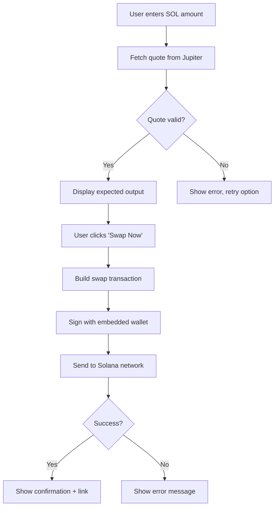

# Jupiter V6 Solana Swap Integration

Complete, production-grade implementation for swapping SOL → TRAPANI using Jupiter Aggregator V6 with an embedded, non-custodial Solana wallet.

## Architecture Overview

### Core Components

1. **`src/config/swap.ts`** - Configuration constants
   - Token mints (SOL, TRAPANI)
   - Slippage tolerance (1.5%)
   - Safety limits and retry settings
   
2. **`src/lib/jupiterV6.ts`** - Jupiter V6 API integration
   - `fetchJupiterQuote()` - Get best swap routes
   - `buildJupiterSwap()` - Build swap transactions
   - Built-in retry logic, timeout handling, error recovery

3. **`src/lib/solana.ts`** - Solana utilities
   - Connection management
   - Unit conversion (SOL ↔ lamports)
   - Transaction helpers
   - Address validation

4. **`src/components/SwapPanel.tsx`** - Main UI component
   - Amount input with validation
   - Quote fetching and display
   - Transaction signing and sending
   - Success/error handling

5. **`src/hooks/useEmbeddedSolWallet.ts`** - Wallet access
   - Returns embedded Privy wallet
   - No external wallet connection required

## How It Works

### 1. Embedded Wallet

The app uses **Privy embedded wallet** - a non-custodial wallet where:
- Keys are generated on the user's device
- Keys never leave the device
- User logs in with email (no seed phrases)
- Wallet is automatically provisioned on first login

```typescript
const { wallet, address, ready } = useEmbeddedSolWallet();
// wallet.sendTransaction() - signs and sends transactions
```

### 2. Swap Flow



### 3. Jupiter V6 API Calls

**Quote Request:**
```
GET https://quote-api.jup.ag/v6/quote?
  inputMint=So11111111111111111111111111111111111111112
  &outputMint=<TRAPANI_MINT>
  &amount=<LAMPORTS>
  &slippageBps=150
```

**Swap Transaction:**
```
POST https://quote-api.jup.ag/v6/swap
Body: {
  quoteResponse: <QUOTE>,
  userPublicKey: <ADDRESS>,
  wrapAndUnwrapSol: true,
  dynamicComputeUnitLimit: true
}
```

### 4. Transaction Signing

The swap transaction is:
1. Built by Jupiter (returns base64 VersionedTransaction)
2. Deserialized in the app
3. Signed by the embedded wallet (`wallet.sendTransaction()`)
4. Sent to Solana network
5. Confirmed and displayed to user

## Configuration

### Update Token Mint

Edit `src/config/swap.ts`:

```typescript
export const TRAPANI_MINT = 'YOUR_TOKEN_MINT_ADDRESS_HERE';
```

### Adjust Slippage

```typescript
export const SLIPPAGE_BPS = 150; // 1.5% (150 basis points)
// Higher = more tolerant to price changes
// Lower = more precise but more likely to fail
```

### Safety Limits

```typescript
export const MIN_SOL_AMOUNT = 0.001; // Minimum swap
export const MIN_SOL_RESERVE = 0.005; // Keep for rent
```

## Error Handling

### Network Errors
- **"Failed to fetch"** - CORS or connectivity issue
  - Automatic retry with exponential backoff
  - User sees: "Network error. Please check connection."

### Quote Errors
- **"No routes found"** - Jupiter can't find a swap route
  - Try reducing amount or different slippage
- **"Invalid quote"** - Malformed response
  - Automatic retry

### Transaction Errors
- **"User rejected"** - User declined in wallet
  - User-friendly message, can retry
- **"Insufficient SOL"** - Not enough balance
  - Shows "Fund with card" button

## Security

### Client-Side Only
- No backend custody of funds
- All operations in browser
- Keys never transmitted

### Input Validation
- Amount must be ≥ 0.001 SOL
- Maximum validated against balance
- Reserves 0.005 SOL for rent/fees

### Precision
- Uses BigInt for lamport calculations
- No floating-point errors
- Integer math throughout

## Integration with MoonPay

MoonPay is already integrated for funding:
- User clicks "Buy Crypto with Card"
- Purchases SOL directly to embedded wallet
- Same address used for swaps
- Balance auto-refreshes after funding

## Troubleshooting

### "Failed to fetch" persists

**Problem:** Browser can't reach Jupiter API (CORS/network block)

**Solutions:**
1. Check if using HTTPS (required for production)
2. Try different network/WiFi
3. Disable browser extensions (ad blockers)
4. Check if Jupiter API is up: https://jup.ag/

### Quote succeeds but swap fails

**Problem:** Price changed between quote and swap

**Solutions:**
1. Increase slippage tolerance
2. Reduce swap amount
3. Try during less volatile times

### Transaction pending forever

**Problem:** Solana network congestion

**Solutions:**
1. Wait 30-60 seconds
2. Check Solscan for transaction status
3. If failed, try again with higher priority fees

### Insufficient SOL error

**Problem:** Not enough SOL for swap + fees

**Solutions:**
1. Reduce swap amount
2. Fund wallet via MoonPay
3. Ensure MIN_SOL_RESERVE (0.005) remains

## Testing

### Manual Test Flow

1. **Login:** Email login creates embedded wallet
2. **Fund:** Buy ~$5 SOL via MoonPay
3. **Quote:** Enter 0.01 SOL, click "Get Quote"
4. **Verify:** Check expected TRAPANI output
5. **Swap:** Click "Swap Now", approve in wallet
6. **Confirm:** See success message + Solscan link
7. **Balance:** Verify SOL decreased, TRAPANI increased

### Console Logs

Enable detailed logging in browser console:
- `[Jupiter Quote]` - Quote fetch attempts
- `[Jupiter Swap]` - Transaction building
- `[Swap]` - Overall swap flow

## Performance

- **Quote fetch:** 1-3 seconds
- **Transaction build:** 1-2 seconds  
- **Confirmation:** 5-10 seconds on Solana
- **Auto-retry:** 3 attempts with backoff
- **Timeout:** 20 seconds per API call

## Production Checklist

- ✅ Update `TRAPANI_MINT` in `src/config/swap.ts`
- ✅ Test with real funds (start small)
- ✅ Verify Solscan links work correctly
- ✅ Test on multiple browsers/devices
- ✅ Ensure HTTPS in production
- ✅ Monitor console for errors
- ✅ Set up error tracking (optional)
- ✅ Test high slippage scenarios
- ✅ Verify balance updates after swap

## Support

- **Jupiter Docs:** https://station.jup.ag/docs
- **Privy Docs:** https://docs.privy.io
- **Solana Docs:** https://docs.solana.com

## License

This implementation is for use in your application as specified.
